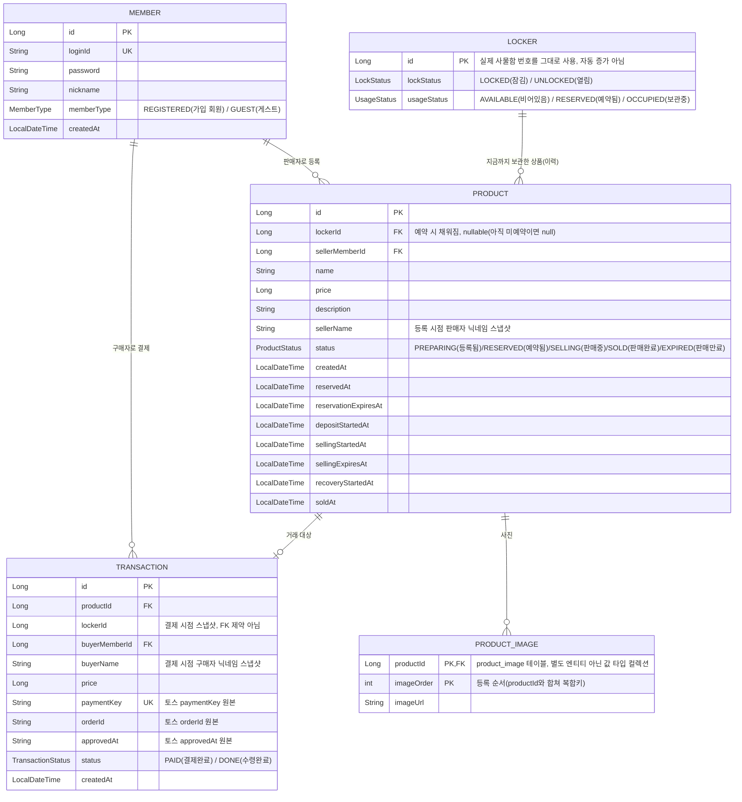

# HACKATHON-TEAM9-KIRIN — 오다가다

## 서비스 설명

**오다가다**는 물품보관함(사물함)을 매개로 하는 비대면 중고거래 서비스다.

- 판매자는 상품을 등록하고 빈 사물함을 예약한 뒤 실물을 넣고 잠근다.
- 구매자는 사물함 앞면에 붙은 QR 코드를 스캔해 그 사물함에 지금 들어있는 상품 정보를
  확인하고, 로그인 없이도 상품을 볼 수 있다.
- 결제(Toss Payments)가 완료되면 해당 사물함이 자동으로 열리고, 구매자는 직접 방문해
  물건을 수령한다.
- 별도의 대면 접촉이나 앱 설치 없이, 웹과 물리 사물함(ESP32 잠금장치)만으로 거래가
  완결된다.

## Tech Stack

| 구분 | 사용 기술 |
|:---:|---|
| **Backend** |         |
| **Frontend** |          |
| **Embedded** |   |
| **Payment** |  |
| **Database** |  |
| **Infrastructure** |       |
| **CI/CD** |     |
| **Testing & Quality** |       |
<br>

## 서비스 아키텍처


- AWS VPC 안에 퍼블릭 서브넷과 프라이빗 서브넷을 나눠 두었다. 프론트엔드(React SPA)와
  백엔드(Spring Boot)는 퍼블릭 서브넷의 같은 EC2 인스턴스에 배포되며, Nginx가 정적
  파일 서빙과 `/api/**` 리버스 프록시를 함께 담당한다.
- MySQL은 프라이빗 서브넷의 별도 EC2에서 실행되고, 애플리케이션 EC2에서만 접근할 수
  있어 외부에 직접 노출되지 않는다.
- 배포는 GitHub Actions가 빌드 산출물을 SSH로 서버에 전달하면, 서버의 `deploy.sh`가
  릴리스 디렉터리를 심볼릭 링크로 원자적으로 교체하고 헬스체크 실패 시 이전 버전으로
  자동 롤백한다.
- ESP32는 실시간 푸시 없이 0.3초 주기로 `GET /api/lockers/{lockerId}/lock-status`를
  폴링해 사물함 문 상태를 반영한다. 이 엔드포인트는 장치가 세션 인증 없이 호출할 수
  있도록 `/api/lockers/**` 전체가 인증에서 제외되어 있다.
- 인증 세션은 별도 세션 스토어(Redis 등) 없이 Spring 기본 인메모리 `HttpSession`으로
  관리된다.

## ERD



- 모든 FK 표시는 실제 DB 외래키 제약이 아니라 애플리케이션에서만 참조하는 `Long` 값이다
  (`@ManyToOne` 미사용, 마이그레이션 도구 미도입).
- `Product.lockerId`는 판매자가 사물함을 예약하는 순간 채워진다. 판매기간이 만료돼
  판매자가 회수를 완료하면(`completeRecovery`) 다시 비워지지만, 구매자가 사서 수령까지
  끝난(`completePickup`) 물품은 상태만 SOLD로 남고 lockerId는 지워지지 않는다. 그래서
  같은 사물함에 여러 Product가 이력으로 쌓이며, 지금 실제로 그 사물함에 있는 상품인지는
  `Product`가 아니라 `Locker.usageStatus`로 따로 확인해야 한다.
- `Transaction.lockerId`는 사물함이 나중에 다른 상품으로 재사용돼도 그 거래가 어느
  사물함에서 이뤄졌는지 이력을 보존하기 위한 스냅샷 값이다.
- `Product.imageUrls`는 별도 엔티티가 아니라 `@ElementCollection`으로 매핑된
  `product_image` 컬렉션 테이블이다(사진 여러 장을 등록 순서대로 저장).

## 프로젝트 구조

```
.
├── backend/                       # Spring Boot API (Java 21 · Gradle)
│   ├── src/main/java/com/kirin/superservice/
│   │   ├── member/ · auth/         # 회원가입, 게스트 세션, 로그인
│   │   ├── locker/                 # 사물함 잠금·사용 상태, ESP32 폴링 API
│   │   ├── product/                # 물품 등록·예약·판매
│   │   ├── transaction/ · payment/ # 결제 승인, 수령 처리 (Toss Payments)
│   │   ├── image/ · health/        # 이미지 업로드, 헬스체크
│   │   └── global/                 # 공통 예외·인증·Slack 알림
│   ├── src/main/resources/        # application*.yaml, 초기 데이터(data.sql)
│   ├── src/test/java/             # 도메인별 단위·컨트롤러 테스트
│   └── deploy/                    # systemd 유닛, 배포 스크립트
├── frontend/                      # React SPA (Vite)
│   ├── src/routes/                # 화면 단위 라우트 (TanStack Router 파일 기반)
│   ├── src/components/{domain,layout,ui}/  # 도메인·레이아웃·shadcn 기반 공용 UI
│   ├── src/api/generated/         # OpenAPI(Orval) 자동 생성 API 클라이언트
│   ├── docs/RULESET.md, DESIGN.md # 프론트엔드 규칙, 디자인 토큰
│   └── deploy/                    # Nginx 설정, 배포 스크립트
├── docs/images/                   # README에 쓰는 다이어그램 이미지
└── .github/workflows/             # 백엔드/프론트엔드 CI·CD, PR 가드
```

## Known Issues

- **ESP32·관리자 페이지 무인증은 의도된 설계**: ESP32가 인증 없이 폴링할 수 있도록
  `/api/lockers/**` 전체(GET·PATCH)를 세션 인증에서 제외했고, `admin/lockers` 화면도
  별도 인가 없이 같은 공개 API를 그대로 쓴다. 지금은 의도한 동작이지만, 추후 보안을
  위해 정식 인가(판매자·구매자 본인 확인) 또는 장치 전용 인증(API 키 등) 도입이
  필요할 것으로 보인다.
- **세션 인메모리 저장**: 별도 세션 스토어(Redis 등) 없이 단일 인스턴스의 인메모리
  `HttpSession`을 사용해, 서버를 다중화하면 세션이 공유되지 않는다.
- **애플리케이션 서버 단일 인스턴스**: 프론트엔드·백엔드는 퍼블릭 서브넷의 EC2 한 대에
  함께 배포되어 있어 무중단 다중화나 오토스케일링이 되지 않는다.
- **ESP32 ↔ 서버 통신이 단방향 폴링**: 실시간 푸시(WebSocket 등) 대신 0.3초 주기 HTTP
  폴링 방식이라 네트워크 상태에 따라 반응 지연이 생길 수 있다. Wi-Fi 재연결이 일정
  시간(15초) 안에 되지 않으면 장치가 자동 재부팅하도록 완화 조치만 되어 있다.

## 개발자 조 구성원 정보

| 이름 | GitHub |
| --- | --- |
| Wongi Kim | [@cylin0201](https://github.com/cylin0201) |
| Jihyeong Hong | [@topograp2](https://github.com/topograp2) |
| Gibeom Lim | [@delphox60](https://github.com/delphox60) |
