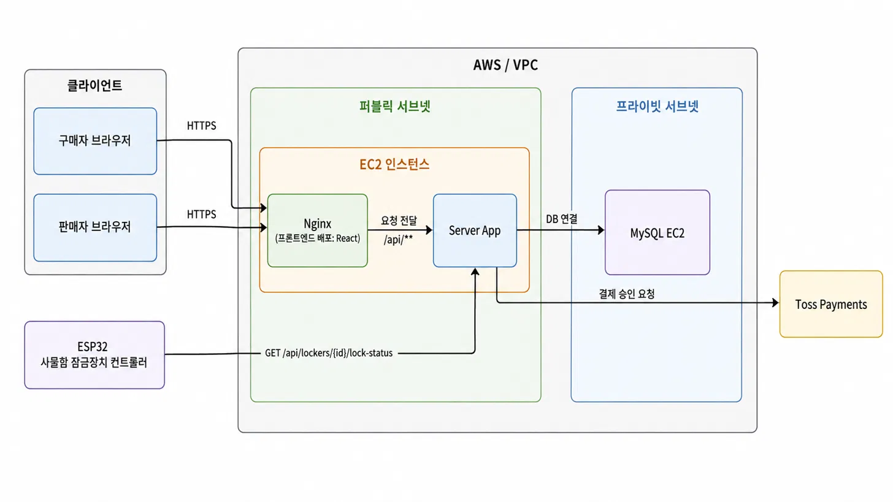
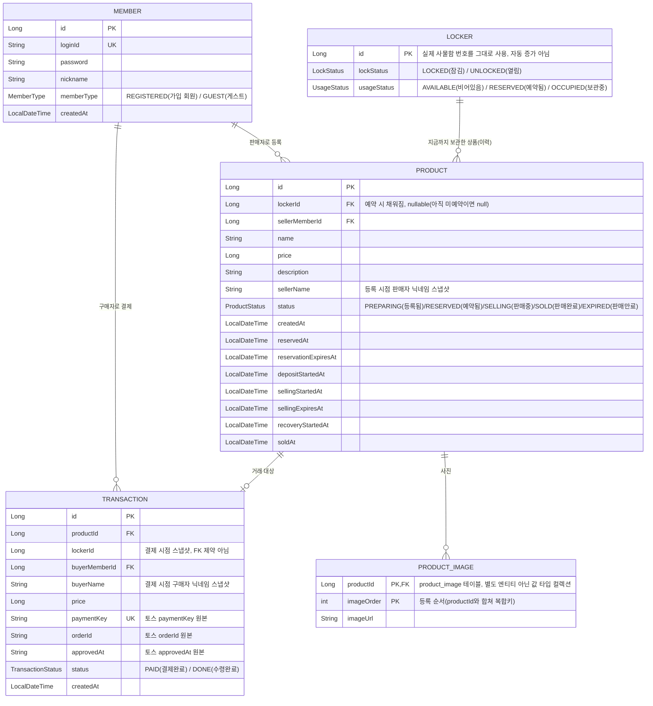

# HACKATHON-TEAM9-KIRIN — 오다가다

## 서비스 설명

**오다가다**는 물품보관함(사물함)을 매개로 하는 비대면 중고거래 서비스다.

- 판매자는 상품을 등록하고 빈 사물함을 예약한 뒤 실물을 넣고 잠근다.
- 구매자는 사물함 앞면에 붙은 QR 코드를 스캔해 그 사물함에 지금 들어있는 상품 정보를
  확인하고, 로그인 없이도 상품을 볼 수 있다.
- 결제(Toss Payments)가 완료되면 해당 사물함이 자동으로 열리고, 구매자는 직접 방문해
  물건을 수령한다.
- 별도의 대면 접촉이나 앱 설치 없이, 웹과 물리 사물함(ESP32 잠금장치)만으로 거래가
  완결된다.

## Tech Stack

| 영역 | 스택 |
| --- | --- |
| Backend | Java 21, Spring Boot 4.1.1, Spring Web MVC, Spring Data JPA, Spring Validation, Spring Actuator, Lombok, MySQL 8.4, Gradle |
| Frontend | React 19, TypeScript, Vite, TanStack Router, TanStack Query, Tailwind CSS v4, shadcn/ui(Radix), Orval(OpenAPI 코드 생성), axios, Toss Payments SDK, pnpm |
| Embedded | ESP32(Arduino/C++) — Wi-Fi HTTP 폴링 기반 사물함 잠금장치 컨트롤러(서보모터 구동) |
| 결제 | Toss Payments API |
| 인프라 · CI/CD | GitHub Actions(백엔드/프론트엔드 CI·CD, PR 가드), AWS VPC(퍼블릭 서브넷 애플리케이션 EC2 + 프라이빗 서브넷 MySQL EC2), Nginx(+ Certbot TLS), systemd(백엔드), Slack 에러 알림 |
| 테스트 | JUnit5 + AssertJ(Backend), Vitest + Testing Library(Frontend) |

## 서비스 아키텍처



- AWS VPC 안에 퍼블릭 서브넷과 프라이빗 서브넷을 나눠 두었다. 프론트엔드(React SPA)와
  백엔드(Spring Boot)는 퍼블릭 서브넷의 같은 EC2 인스턴스에 배포되며, Nginx가 정적
  파일 서빙과 `/api/**` 리버스 프록시를 함께 담당한다.
- MySQL은 프라이빗 서브넷의 별도 EC2에서 실행되고, 애플리케이션 EC2에서만 접근할 수
  있어 외부에 직접 노출되지 않는다.
- 배포는 GitHub Actions가 빌드 산출물을 SSH로 서버에 전달하면, 서버의 `deploy.sh`가
  릴리스 디렉터리를 심볼릭 링크로 원자적으로 교체하고 헬스체크 실패 시 이전 버전으로
  자동 롤백한다.
- ESP32는 실시간 푸시 없이 0.3초 주기로 `GET /api/lockers/{lockerId}/lock-status`를
  폴링해 사물함 문 상태를 반영한다. 이 엔드포인트는 장치가 세션 인증 없이 호출할 수
  있도록 `/api/lockers/**` 전체가 인증에서 제외되어 있다.
- 인증 세션은 별도 세션 스토어(Redis 등) 없이 Spring 기본 인메모리 `HttpSession`으로
  관리된다.

## ERD



- 모든 FK 표시는 실제 DB 외래키 제약이 아니라 애플리케이션에서만 참조하는 `Long` 값이다
  (`@ManyToOne` 미사용, 마이그레이션 도구 미도입).
- `Product.lockerId`는 판매자가 사물함을 예약하는 순간 채워진다. 판매기간이 만료돼
  판매자가 회수를 완료하면(`completeRecovery`) 다시 비워지지만, 구매자가 사서 수령까지
  끝난(`completePickup`) 물품은 상태만 SOLD로 남고 lockerId는 지워지지 않는다. 그래서
  같은 사물함에 여러 Product가 이력으로 쌓이며, 지금 실제로 그 사물함에 있는 상품인지는
  `Product`가 아니라 `Locker.usageStatus`로 따로 확인해야 한다.
- `Transaction.lockerId`는 사물함이 나중에 다른 상품으로 재사용돼도 그 거래가 어느
  사물함에서 이뤄졌는지 이력을 보존하기 위한 스냅샷 값이다.
- `Product.imageUrls`는 별도 엔티티가 아니라 `@ElementCollection`으로 매핑된
  `product_image` 컬렉션 테이블이다(사진 여러 장을 등록 순서대로 저장).

## 프로젝트 구조

```
.
├── backend/    # Spring Boot 애플리케이션 (Java 21, Gradle)
└── frontend/   # 프론트엔드 애플리케이션
```

## Backend

- Java 21 / Spring Boot 4.1.1 / Gradle 9.5.1
- Spring Web MVC, Spring Data JPA, Lombok

### 실행

```bash
cd backend
./gradlew bootRun
```

### 테스트

```bash
cd backend
./gradlew test
```

## Frontend

- React 19 / TypeScript / Vite, TanStack Router · Query, Tailwind v4 + shadcn/ui
- 자세한 규칙은 [`frontend/docs/RULESET.md`](frontend/docs/RULESET.md), 디자인 토큰은
  [`frontend/DESIGN.md`](frontend/DESIGN.md) 참조

### 실행

```bash
cd frontend
pnpm install
pnpm dev
```

## Known Issues

- **QR 실제 디코딩 미구현**: 구매자 스캔 화면(`buyer/scan.tsx`)은 카메라로 QR을 실제
  인식하지 않고, 스캔 버튼 클릭을 데모로 시뮬레이션해 사물함 상세로 이동한다.
- **`/api/lockers/**` 전체가 무인증**: ESP32가 인증 없이 폴링할 수 있도록 GET·PATCH를
  모두 세션 인증에서 제외했다. 그 결과 사물함 잠금 상태 변경(PATCH)도 로그인 없이 누구나
  호출할 수 있는 임시 상태이며, 정식 인가(판매자·구매자 본인 확인) 또는 장치 전용 인증
  (API 키 등)이 아직 도입되지 않았다.
- **데모용 상태 전이 단축 로직**: 사물함을 잠그는 PATCH 요청 하나로 물품 투입 완료·회수
  완료·구매 수령 완료가 한 번에 처리된다(`ProductService`, `TransactionService`). 실제
  투입/수령 절차의 본인 확인 단계를 생략한 임시 로직이다.
- **관리자 페이지 무인증**: `admin/lockers` 화면이 별도 인가 없이 공개 API를 그대로
  사용한다.
- **세션 인메모리 저장**: 별도 세션 스토어(Redis 등) 없이 단일 인스턴스의 인메모리
  `HttpSession`을 사용해, 서버를 다중화하면 세션이 공유되지 않는다.
- **애플리케이션 서버 단일 인스턴스**: 프론트엔드·백엔드는 퍼블릭 서브넷의 EC2 한 대에
  함께 배포되어 있어 무중단 다중화나 오토스케일링이 되지 않는다.
- **ESP32 ↔ 서버 통신이 단방향 폴링**: 실시간 푸시(WebSocket 등) 대신 0.3초 주기 HTTP
  폴링 방식이라 네트워크 상태에 따라 반응 지연이 생길 수 있다. Wi-Fi 재연결이 일정
  시간(15초) 안에 되지 않으면 장치가 자동 재부팅하도록 완화 조치만 되어 있다.

## 개발자 조 구성원 정보

| 이름 | GitHub |
| --- | --- |
| Wongi Kim | [@cylin0201](https://github.com/cylin0201) |
| Jihyeong Hong | [@topograp2](https://github.com/topograp2) |
| Gibeom Lim | [@delphox60](https://github.com/delphox60) |
